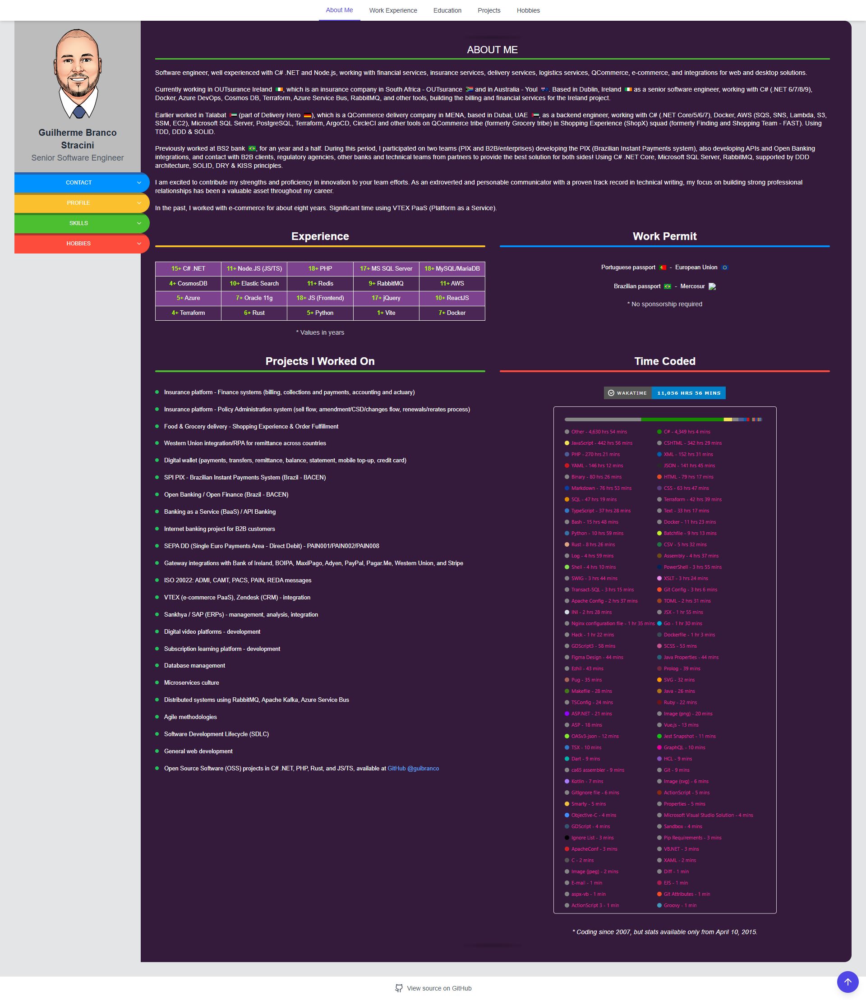
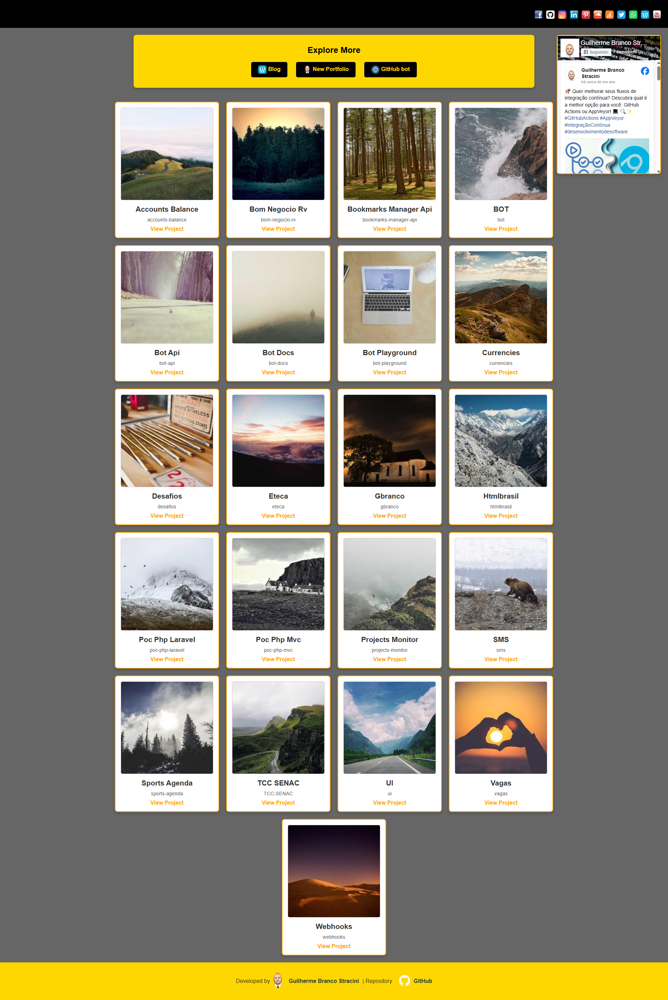

# Guilherme Branco Stracini - Personal Portfolio

> 💻 Professional portfolio and resume website hosted on GitHub Pages: [https://guilherme.stracini.com.br](https://guilherme.stracini.com.br)

## 📋 Overview

This repository contains the source code for my personal portfolio website, showcasing my professional experience, skills, and projects. The current version was initially designed in 2018 and is hosted using GitHub Pages.

## 🗂️ Portfolio Versions

<table>
  <tr>
    <td width="50%">
      <strong>Current Version (2018)</strong> 
       
      The current portfolio functions as a comprehensive resume, highlighting my professional experience, skills, and personal interests. This version focuses on presenting my career trajectory and accomplishments in a clean, modern interface.  
      <b>Website:</b> <a href="https://guilherme.stracini.com.br">https://guilherme.stracini.com.br</a> 
      <b>Repository:</b> <a href="https://github.com/guibranco/guibranco.github.io">guibranco/guibranco.github.io</a>
    </td>
    <td width="50%">
      <strong>Previous Version (2007)</strong> 
       
      The original portfolio version remains accessible and contains a collection of earlier projects that are still hosted on my legacy hosting account.  
      <b>Website:</b> <a href="https://zerocool.com.br">https://zerocool.com.br</a> 
      <b>Repository:</b> <a href="https://github.com/guibranco/zerocool">guibranco/zerocool</a>
    </td>
  </tr>
</table>

## 🔗 Domain Aliases

The portfolio is accessible through multiple domains:

- [guilhermestracini.com.br](https://guilhermestracini.com.br)
- [guilhermestraccini.com.br](https://guilhermestraccini.com.br)
- [guilherme.straccini.com](https://guilherme.straccini.com)
- [guilherme.straccini.com.br](https://guilherme.straccini.com.br)
- [guilherme.stracini.com](https://guilherme.stracini.com)
- [guilherme.stracini.com.br](https://guilherme.stracini.com.br)
- [guilhermebranco.com.br](https://guilhermebranco.com.br)
- [straccini.com](https://straccini.com)
- [straccini.com.br](https://straccini.com.br)
- [stracini.com](https://stracini.com)
- [stracini.com.br](https://stracini.com.br)

## 📦 Technologies

- [React](https://reactjs.org/) - JavaScript library for building user interfaces
- [Vite](https://vitejs.dev/) - Next generation frontend tooling
- [TailwindCSS](https://tailwindcss.com/) - Utility-first CSS framework
- HTML5
- CSS3
- JavaScript
- GitHub Pages for hosting

## ⚖️ License

Copyright © Guilherme Branco Stracini 2018 - 2025
